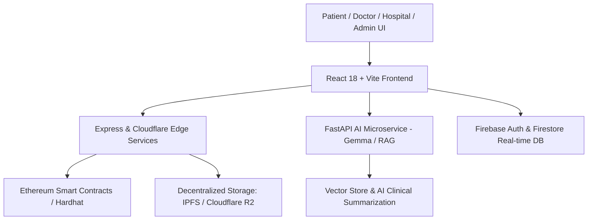

# 🏥 AI-Powered Health Chain

> **Next-Generation Decentralized & AI-Enhanced Electronic Health Record (EHR) Ecosystem**  
> Securing Patient Records with Ethereum Smart Contracts, Zero-Knowledge Privacy, Decentralized Storage (IPFS / Cloudflare R2), and On-Device/Cloud Medical AI (RAG & Gemma).

---

## 🌟 Key Highlights & Architecture



- 🔒 **Blockchain Integrity**: Immutable audit trails and cryptographic consent records managed via Ethereum smart contracts (`Healthcare.sol`).
- 🤖 **AI Medical Intelligence**: AI Assistant, RAG-driven clinical documentation, symptom analysis, and privacy-first local inference.
- 👥 **Multi-Role Portals**: Tailored interfaces for **Patients**, **Doctors**, **Hospitals (ERP)**, **Clinical Teams**, and **System Admins**.
- 🔐 **End-to-End Cryptography**: Client-side AES-GCM data encryption with PIN-gated security before storage in IPFS / Cloudflare R2.
- 🌐 **Global Accessibility**: Multi-language support (English & Telugu), responsive dark-mode glassmorphic aesthetics.

---

## 📁 Repository Structure

```plaintext
├── src/                      # React 18 frontend (Vite, Tailwind, Zustand)
│   ├── components/           # Reusable UI components & interactive charts
│   ├── pages/                # Role dashboards (Patient, Doctor, Hospital, Admin, AI)
│   │   ├── admin/            # Access control, audit explorer, network stats
│   │   ├── ai/               # AI Chat, prompt engineering, knowledge base
│   │   ├── clinical/         # Clinical analytics, consent sessions, team workspace
│   │   ├── hospital/         # Hospital ERP, organization onboarding
│   │   └── subpages/         # ABHA flow, document vault, vital trends
│   ├── routes/               # Role-based route definitions & authentication guards
│   ├── services/             # Blockchain (Web3/Ethers), IPFS, R2, API client
│   └── store/                # Zustand global state managers
├── server/                   # Node.js & Express REST Backend
│   ├── controllers/          # Auth, Access requests, EHR record controllers
│   ├── middleware/           # RBAC, Rate-limiting, Audit logging, Tenant isolation
│   └── services/             # Encryption, APM metrics, Cache & Queue managers
├── fastapi_server/           # Python AI Microservice (FastAPI + Gemma + RAG)
├── blockchain/               # Hardhat smart contracts & deployment scripts
│   ├── contracts/            # Healthcare.sol smart contract
│   └── scripts/              # Automated deployment scripts
├── functions/                # Firebase Cloud Functions (Serverless handlers)
├── healthchain-landing/      # Dedicated 3D-interactive promotional landing page
└── worker/                   # Cloudflare edge worker scripts & SQL schemas
```

---

## 🚀 Quick Start & Installation

### Prerequisites
- **Node.js**: `v18.x` or higher
- **npm** or **yarn**
- **Python**: `3.10+` (for AI microservice)

---

### 1. Clone the Repository
```bash
git clone https://github.com/chinnaranga/-AI-powered-Health-Chain.git
cd -AI-powered-Health-Chain
```

### 2. Install Frontend & Backend Dependencies
```bash
# Install root/frontend dependencies
npm install

# Install server dependencies
cd server && npm install && cd ..

# Install cloud functions dependencies (optional)
cd functions && npm install && cd ..
```

### 3. Configure Environment Variables
Copy `.env.example` to `.env` and supply your credentials:
```bash
cp .env.example .env
```

Key environment variables:
```ini
# Firebase Config
VITE_FIREBASE_API_KEY=your_api_key
VITE_FIREBASE_AUTH_DOMAIN=your_auth_domain
VITE_FIREBASE_PROJECT_ID=your_project_id
VITE_FIREBASE_STORAGE_BUCKET=your_storage_bucket

# Blockchain & Web3
VITE_HARDHAT_NETWORK_URL=http://127.0.0.1:8545
VITE_CONTRACT_ADDRESS=0x...

# Backend API
VITE_API_URL=http://localhost:5000
VITE_AI_SERVICE_URL=http://localhost:8000
```

---

### 4. Running the Applications

#### 🌐 Start the Frontend (Vite)
```bash
npm run dev
```
> The application will start at `http://localhost:5173`.

#### ⚙️ Start the Express Server
```bash
cd server
npm run dev # or node server.js
```
> Server runs on `http://localhost:5000`.

#### 🧠 Start the AI Microservice (FastAPI)
```bash
cd fastapi_server
python -m venv .venv
source .venv/bin/activate # On Windows: .venv\Scripts\activate
pip install -r requirements.txt
uvicorn main:app --reload --port 8000
```

#### ⛓️ Compile & Deploy Smart Contracts (Hardhat)
```bash
cd blockchain
npx hardhat compile
npx hardhat node
# In a new terminal:
npx hardhat run scripts/deploy.cjs --network localhost
```

---

## 🛡️ Security & Privacy Compliance

- **Zero-Knowledge Principle**: Raw medical records are never uploaded unencrypted.
- **Granular Consent Model**: Time-bounded, revocation-capable access tokens for doctors & healthcare providers.
- **Audit Trails**: Every view, download, and modification action is signed and stored as an immutable audit record.
- **HIPAA / GDPR / ABDM Ready**: Designed around international data privacy standards and national digital health architectures (ABHA ID integration ready).

---

## 🤝 Contributing

Contributions, issues, and feature requests are welcome!

1. Fork the Project
2. Create your Feature Branch (`git checkout -b feature/AmazingFeature`)
3. Commit your Changes (`git commit -m 'Add some AmazingFeature'`)
4. Push to the Branch (`git push origin feature/AmazingFeature`)
5. Open a Pull Request

---

## 📄 License

Distributed under the **MIT License**. See `LICENSE` for more information.
